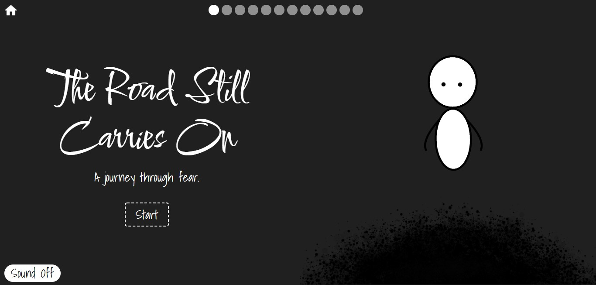
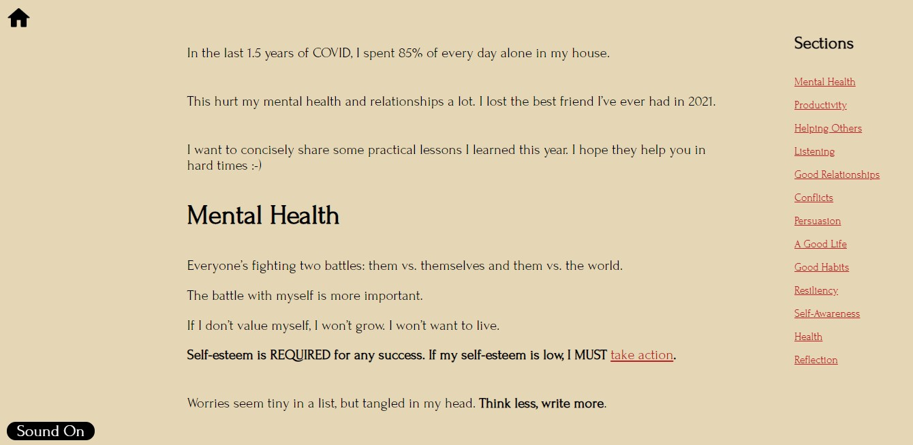

# 2021 Annual Reflection

This is a compilation of all the lessons I've learned in 2021. I was inspired to animate it by Nicky Case's [Trust](https://www.ncase.me/trust). If you'd like to see the final reflection, it's on my [website](https://www.madhavmalhotra.com/blog/2021-Annual-Reflection/index.html) :-)

In this repository, you'll find:
- The [credits](./credits.html) for all the music, text, images, coding libraries, and animation tools I used.
- The `assets` folder with raw spritesheet, css, javascript, and music files. 
- The [index](./index.html), [poetic](./poetic.html), and [practical](./practical.html) pages of the reflection.
